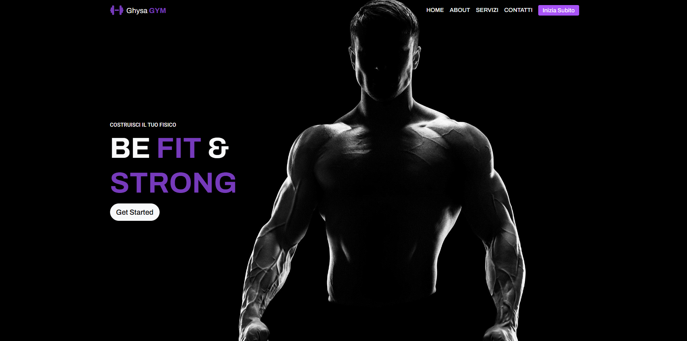

# My Ghisa Gym App 🏋️‍♂️

Un'applicazione web per la gestione dei piani di allenamento, la registrazione degli utenti, la visualizzazione degli esercizi, e la gestione dei piani personalizzati. Realizzata con React, Redux, Bootstrap, Material-UI e altre librerie moderne.

😊


## Funzionalità 🚀

- **Registrazione e Login**: Gli utenti possono registrarsi e accedere con il proprio account.
- **Gestione Account**: Gli utenti possono modificare i propri dati personali e caricare un avatar.
- **Piani di Allenamento**: Creazione e gestione dei piani di allenamento personalizzati.
- **Back Office**: Sezione amministrativa per aggiungere, modificare ed eliminare esercizi.
- **Feedback dell'utente**: Notifiche di successo e errore tramite Snackbar.


## Tecnologie Utilizzate 💻

- **React**: Per costruire l'interfaccia utente.
- **Redux**: Per la gestione dello stato globale dell'app.
- **React Router**: Per gestire la navigazione tra le pagine.
- **Material UI**: Per le componenti UI (ad esempio,Navbar, Snackbar, Alert etc..).
- **React Bootstrap**: Per la struttura e i layout responsivi.
- **Framer Motion**: Per animazioni fluide e interattive nei componenti.
- **FontAwesome**: Per l'uso di icone vettoriali nell'interfaccia utente.


## Prerequisiti 📦

Prima di iniziare, assicurati di avere i seguenti strumenti installati:

- **Node.js** (versione 16 o superiore): [https://nodejs.org/](https://nodejs.org/)
- **npm** (Node Package Manager): Viene installato automaticamente con Node.js.

## Installazione 🛠️

1. **Scarica il progetto come ZIP**:
   - Vai su [https://github.com/Pietroro98/FRONTEND-CapstoneProject](https://github.com/Pietroro98/FRONTEND-CapstoneProject) e clicca sul pulsante **Code**, quindi seleziona **Download ZIP**.

2. **Estrai il file ZIP**:
   - Estrai il contenuto dell'archivio nella tua cartella preferita.

3. **Installa le dipendenze**:
   - Apri il terminale o il prompt dei comandi e naviga nella cartella dove hai estratto il progetto.
   - Esegui il comando per installare tutte le dipendenze necessarie:

     ```bash
     npm install
     ```

4. **Avvia l'app**:
   - Esegui il comando per avviare l'app in modalità di sviluppo:

     ```bash
     npm start
     ```

5. **Visualizza l'app**:
   - Apri il tuo browser e vai su [http://localhost:3000](http://localhost:3000) per vedere l'app in esecuzione.

# Collegamento al Backend del mio progetto 🌍
Visita il Back-end del mio progetto **My Ghisa Gym**
👉(https://github.com/Pietroro98/BACKEND-CapstoneProject)👈

## Learn More 📚

You can learn more in the [Create React App documentation](https://facebook.github.io/create-react-app/docs/getting-started).

To learn React, check out the [React documentation](https://reactjs.org/).

### Code Splitting

This section has moved here: [https://facebook.github.io/create-react-app/docs/code-splitting](https://facebook.github.io/create-react-app/docs/code-splitting)

### Analyzing the Bundle Size

This section has moved here: [https://facebook.github.io/create-react-app/docs/analyzing-the-bundle-size](https://facebook.github.io/create-react-app/docs/analyzing-the-bundle-size)

### Making a Progressive Web App

This section has moved here: [https://facebook.github.io/create-react-app/docs/making-a-progressive-web-app](https://facebook.github.io/create-react-app/docs/making-a-progressive-web-app)

### Advanced Configuration

This section has moved here: [https://facebook.github.io/create-react-app/docs/advanced-configuration](https://facebook.github.io/create-react-app/docs/advanced-configuration)

### Deployment

This section has moved here: [https://facebook.github.io/create-react-app/docs/deployment](https://facebook.github.io/create-react-app/docs/deployment)

### `npm run build` fails to minify

This section has moved here: [https://facebook.github.io/create-react-app/docs/troubleshooting#npm-run-build-fails-to-minify](https://facebook.github.io/create-react-app/docs/troubleshooting#npm-run-build-fails-to-minify)
